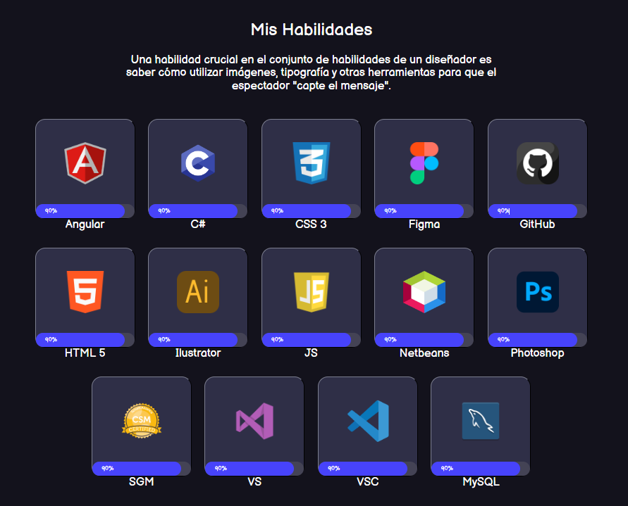

<h1 align="center">Hola, soy <a href="">FacuDev</a> 👋</h1>

<h3 align="left">Contactame:</h3>

  
  
  
 

<input 

<strong>Bienvenido a mi perfil!

Soy Facundo, técnico electrónico egresado de la Esc. técnica Nº 1 Gral, Francisco Ramírez, habiendo realizado mis estudios primarios en la escuela ICEBEM N127, Pastor Enrique Marconi.
Soy Scrum Grand Master, curso acreditado y aprobado con modalidad online en la universidad tecnológica de Bs As. Hoy en día me desempeño como freelance en informática en gral. (Venta de Hardware, asistencia en software, etc.)
Entrusiasmado, me encuentro finalizando TUP (Tecnico Universitario en Programación) en la Universidad Tecnológica Nacional, aportando desde mi lugar y a su vez aprovechando lo que me aporta la carrera, poniendo en practica, intercambiando experiencia y saber.
Me gusta pensar "fuera de la caja" y suelo expresarlo con la frase del famoso y celebre creador del algoritmo Dijkstra:

_"Wondering when computers will be able to think is like wondering when submarines will be able to swim"_
**Edsger Dijkstra**

Sin más, los saludo atte.

Facundo Aragón

